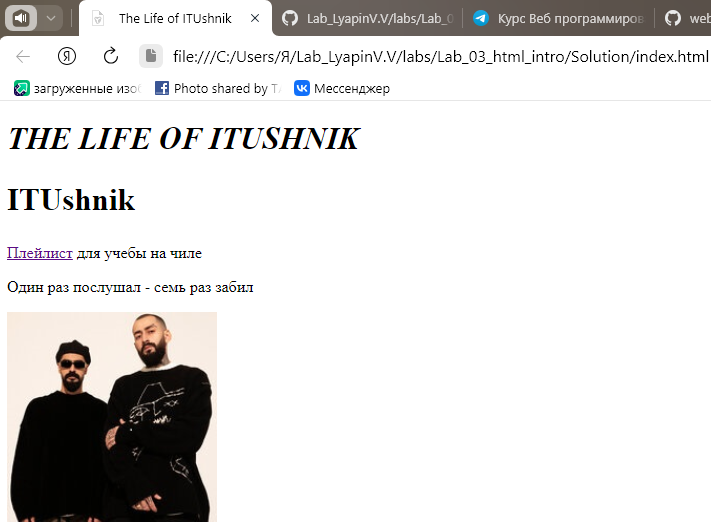

# Знакомство с HTML
___________________________________________________
## Лабораторная работа №3
***Ляпин В.В [АСБ-3-036]***
___________________________________________________

### Код:
```html
<!DOCTYPE html>
<html lang="ru">

<head>
    <meta charset="UTF-8" ; />
    <meta http-equiv='X-UA-Compatible' content='IE=edge'>
    <title>The Life of ITUshnik</title>
    <meta name='viewport' content='width=device-width, initial-scale=1'>
    <link rel="stylesheet" href="base_style.css" />
</head>

<body>
    <h1 style="font-size: 31px; text-transform: uppercase; font-style: italic;">The Life of ITUshnik</h1>
    <h2 style="font-size: 31px;">ITUshnik</h2>
    <p><a href="https://music.yandex.ru/users/yamusic-bestsongs/playlists/4611844" target="_blank">Плейлист</a> для учебы на чиле</p>
    <p>Один раз послушал - семь раз забил</p>
    
</body>

</html>
```


### Результат:


Hajime...