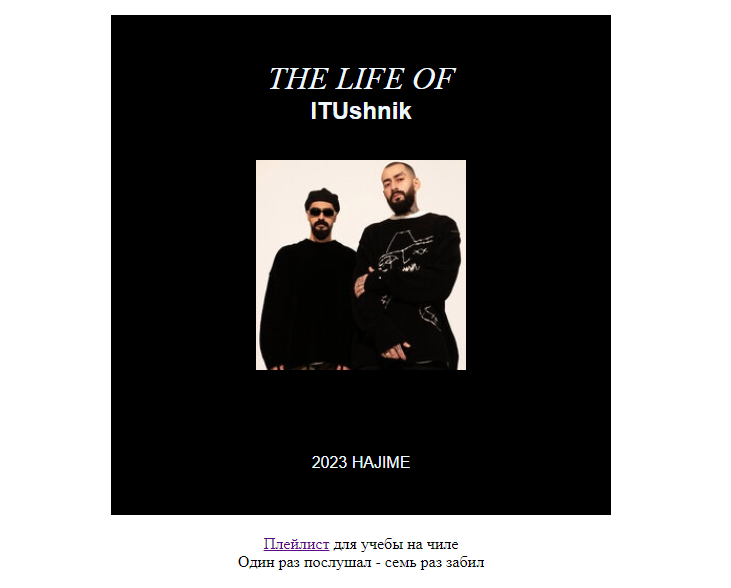

# Знакомство с CSS и продолжение HTML
___________________________________________________
## Лабораторная работа №4
***Ляпин В.В. [АСБ-3-036]***
___________________________________________________



### Код HTML:
```html
<!DOCTYPE html>
<html lang="ru">
<head>
    <meta charset='utf-8'>
    <meta http-equiv='X-UA-Compatible' content='IE=edge'>
    <title>The Life of ITUshnik</title>
    <meta name='viewport' content='width=device-width, initial-scale=1'>
    <link rel='stylesheet' type='text/css' media='screen' href='main.css'>
    <link rel="stylesheet" href="style.css">
</head>
<body style="background-image: url('imgs\BACK.png');">
    <div>
        <h1>The Life of</h1>
        <h2>ITUshnik</h2>
        
        <h3>2023 Hajime</h3>
    </div>
    <p><a href="https://music.yandex.ru/users/yamusic-bestsongs/playlists/4611844" target="_blank">Плейлист</a> для учебы на чиле</p>
    <p>Один раз послушал - семь раз забил</p>
</body>
</html>
```

### Код CSS:

```shell
body {
    min-width: 850px;
    background-image: url('imgs\BACK.png');
    background-size: cover;
    background-repeat: no-repeat;
}

img {
    width: 210px;
    margin-bottom: 80px;
}

h1, h2, h3 {
    color: aliceblue;
}

h1 {
    font-family: "William", serif;
    font-style: italic;
    font-weight: normal;
    text-transform: uppercase;
    padding-top: 45px;
    margin-bottom: 0px;
}

h2 {
    font-family: "Inter", sans-serif;
    margin-top: 0px;
    margin-bottom: 35px;
}

h3 {
    font-family: "Inter", sans-serif;
    font-size: 16px;
    text-transform: uppercase;
    line-height: 18px;
    font-weight: normal;
    margin: 0;
}

div {
    background-color: black;
    background-image: url('imgs\BACK.png');
    background-repeat: no-repeat;
    background-size: cover;
    width: 500px;
    height: 500px;
    text-align: center;
    margin: 0 auto 20px;
}

p {
    margin-top: 0;
    margin-bottom: 0;
    text-align: center;
}
```
Hajime...