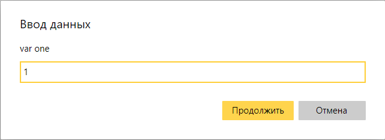
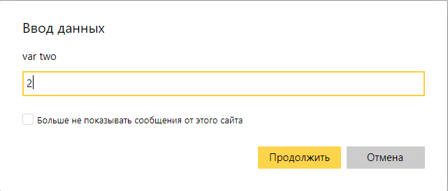
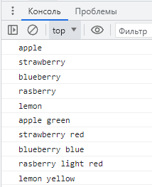
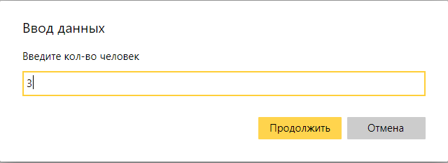
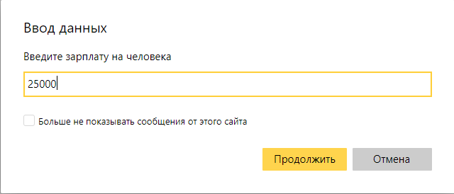
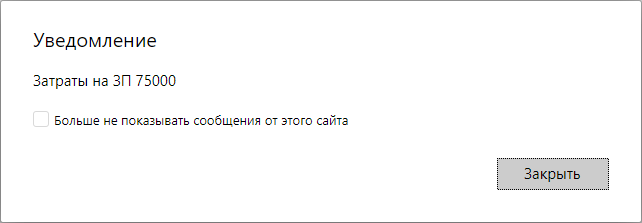
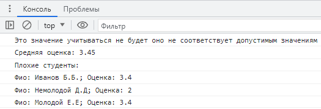

# Рефакторинг кода 
___________________________________________________
## Лабораторная работа №7
***Ляпин В.В. [АСБ-3-036]***
___________________________________________________

### Задание 1. level stone

```javaScript
    var first_promt = prompt('var one');
    var second_promt = prompt('var two');

    if (first_promt === second_promt) {
        console.log('equally');
    } else {
        console.log('unequally');
    }

    var first_promt = 'world';
    var first_promt = first_promt + second_promt;
```




### Задание №2. level iron

```JavaScript
    let colored_fruits = {
        'apple': 'green',
        'strawberry': 'red',
        'blueberry': 'blue',
        'rasberry': 'light red',
        'lemon': 'yellow'
    }

    fruits = Object.keys(colored_fruits)
    colors = Object.values(colored_fruits)

    for (let key in fruits) {
        console.log(fruits[key]);
    }

    for (let key in fruits) {
        console.log(fruits[key] + ' ' + colors[key]);
    }
```


### Задание 3. level gold

```JavaScript
var quantity_of_workers = prompt ('Введите кол-во человек ', undefined);

    if (!isNaN(parseFloat(quantity_of_workers))) {
        quantity_of_workers = parseFloat(quantity_of_workers);
    } else {
        quantity_of_workers = 0;
    }

    while (quantity_of_workers === 0) {

        quantity_of_workers = prompt ('Введите кол-во человек ', undefined);

        if (!isNaN(parseFloat(quantity_of_workers))) {
            quantity_of_workers = parseFloat(quantity_of_workers);
        } else {
            quantity_of_workers = 0;
        }

    }

    var salary_per_worker = prompt ('Введите зарплату на человека ', undefined);

    if (!isNaN(parseFloat(salary_per_worker))) {
        salary_per_worker = parseFloat(salary_per_worker);
    } else {
        salary_per_worker = 0;
    }

    while (salary_per_worker === 0) {

        salary_per_worker = prompt ('Введите зарплату на человека ', undefined);

        if (!isNaN(parseFloat(salary_per_worker))) {
            salary_per_worker = parseFloat(salary_per_worker);
        } else {
            salary_per_worker = 0;
        }

    }

    alert('Затраты на ЗП ' + quantity_of_workers*salary_per_worker);
```




### Задание 4

```JavaScript
var group_of_students = [{full_name:'Петров А.А.',rating:5},
    {full_name:'Иванов Б.Б.',rating:3.4},{full_name:'Сидоров Г.Г.',rating:9},
    {full_name:'Немолодой Д.Д',rating:2},{full_name:'Молодой Е.Е',rating:3.4}];

    var average_rating = 0;
    var quality_of_students = 0;
    var bad_students = [];

    for (var index_for_students = 0; index_for_students < group_of_students.length; index_for_students++) {
        
        if (group_of_students[index_for_students].rating > 5) {
             console.log('Это значение учитываться не будет оно не соответствует допустимым значениям');
        }

        if (group_of_students[index_for_students].rating < 0) {
            console.log('Это значение учитываться не будет оно не соответствует допустимым значениям');
        }

        //Не уверен, но тут может быть перенос строки
        if (!(group_of_students[index_for_students].rating <= 5 && group_of_students[index_for_students].rating >= 0)) {
            continue;
        }

        if (group_of_students[index_for_students].rating < 4) {
            bad_students.push(group_of_students[index_for_students]);
        }

        average_rating += group_of_students[index_for_students].rating;
        quality_of_students += 1;
    }

    average_rating = average_rating / quality_of_students;

    console.log('Средняя оценка: ' + average_rating);

    console.log('Плохие студенты:');

    if(bad_students.length === 0) {
        console.log('Таких нет');
    }

    bad_students.forEach((index) => {console.log('Фио: ' + index.full_name + '; Оценка: ' + index.rating) });
```


#### Все красиво, все прошло рефакторинг и главное все работает ЮЮЮХХХУУУ!