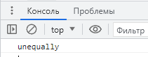

# Рефакторинг кода 
___________________________________________________
## Лабораторная работа №7
***Ляпин В.В. [АСБ-3-036]***
___________________________________________________

### Задание 1. level stone

```javaScript
    var first_promt = prompt('var one');
    var second_promt = prompt('var two');

    if (first_promt === second_promt) {
        console.log('equally');
    } else {
        console.log('unequally');
    }

    var first_promt = 'world';
    var first_promt = first_promt + second_promt;
```




### Задание №2. level iron

```JavaScript
    let colored_fruits = {
        'apple': 'green',
        'strawberry': 'red',
        'blueberry': 'blue',
        'rasberry': 'light red',
        'lemon': 'yellow'
    }

    fruits = Object.keys(colored_fruits)
    colors = Object.values(colored_fruits)

    for (let key in fruits) {
        console.log(fruits[key]);
    }

    for (let key in fruits) {
        console.log(fruits[key] + ' ' + colors[key]);
    }
```


### Задание 3. level gold

```JavaScript
        let quantityOfWorkers = prompt('Введите кол-во человек', undefined);

        if (!isNaN(parseFloat(quantityOfWorkers))) {
            quantityOfWorkers = parseFloat(quantityOfWorkers);
        } else {
            quantityOfWorkers = 0;
        }

        while (quantityOfWorkers === 0) {
            quantityOfWorkers = prompt('Введите кол-во человек', undefined);

            if (!isNaN(parseFloat(quantityOfWorkers))) {
                quantityOfWorkers = parseFloat(quantityOfWorkers);
            } else {
                quantityOfWorkers = 0;
            }
        }

        let salaryPerWorker = prompt('Введите зарплату на человека', undefined);

        if (!isNaN(parseFloat(salaryPerWorker))) {
            salaryPerWorker = parseFloat(salaryPerWorker);
        } else {
            salaryPerWorker = 0;
        }

        while (salaryPerWorker === 0) {
            salaryPerWorker = prompt('Введите зарплату на человека', undefined);

            if (!isNaN(parseFloat(salaryPerWorker))) {
                salaryPerWorker = parseFloat(salaryPerWorker);
            } else {
                salaryPerWorker = 0;
            }
        }

        alert('Затраты на ЗП ' + quantityOfWorkers * salaryPerWorker);
```


### Задание 4

```JavaScript
    let groupOfStudents = [{fullName:'Петров А.А.',rating:5},
    {fullName:'Иванов Б.Б.',rating:3.4},{fullName:'Сидоров Г.Г.',rating:9},
    {fullName:'Немолодой Д.Д',rating:2},{fullName:'Молодой Е.Е',rating:3.4}];

    let averageRating = 0;
    let qualityOfStudents = 0;
    let badStudents = [];

    for (let indexForStudents = 0; indexForStudents < groupOfStudents.length; indexForStudents++) {

        if (groupOfStudents[indexForStudents].rating > 5) {
             console.log('Это значение учитываться не будет оно не соответствует допустимым значениям');
        }

        if (groupOfStudents[indexForStudents].rating < 0) {
            console.log('Это значение учитываться не будет оно не соответствует допустимым значениям');
        }

        if (!(groupOfStudents[indexForStudents].rating <= 5 && groupOfStudents[indexForStudents].rating >= 0)) {
            continue;
        }

        if (groupOfStudents[indexForStudents].rating < 4) {
            badStudents.push(groupOfStudents[indexForStudents]);
        }

        averageRating += groupOfStudents[indexForStudents].rating;
        qualityOfStudents += 1;
    }

    averageRating = averageRating / qualityOfStudents;

    console.log('Средняя оценка: ' + averageRating);

    console.log('Плохие студенты:');

    if(badStudents.length === 0) {
        console.log('Таких нет');
    }

    badStudents.forEach((index) => {console.log('Фио: ' + index.fullName + '; Оценка: ' + index.rating) });
```


#### Все красиво, все прошло рефакторинг и главное все работает ЮЮЮХХХУУУ!