# Обработка событий в java script
___________________________________________________
## Лабораторная работа №8
***Ляпин В.В. [АСБ-3-036]***
___________________________________________________
#### Задание 1. Начало
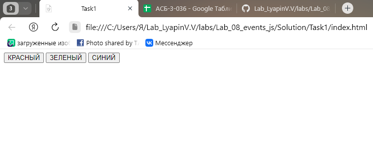
___________________________________________________
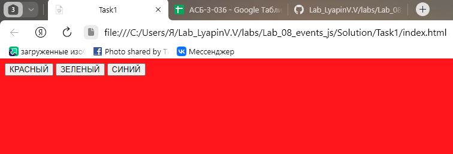
___________________________________________________
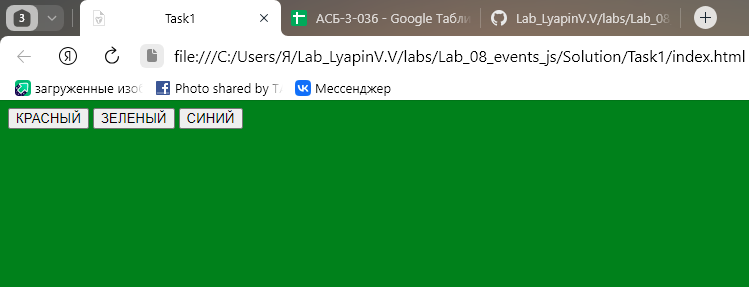
___________________________________________________
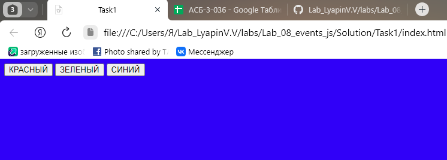
___________________________________________________
#### Задание 2. Добавления функционала

___________________________________________________
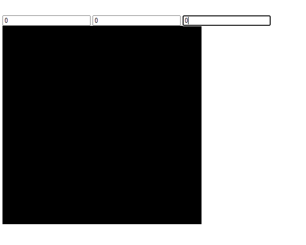
___________________________________________________
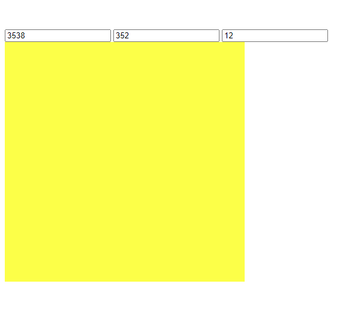
___________________________________________________
#### Задание 3. Работа со списками и объектами на практике
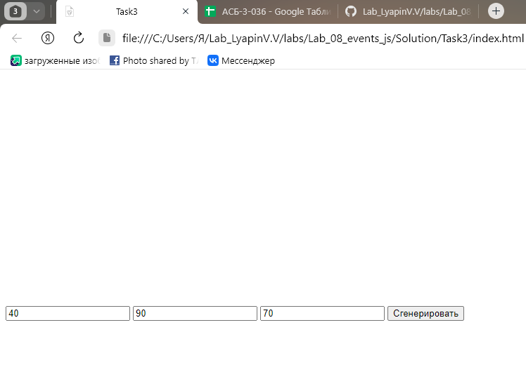
___________________________________________________
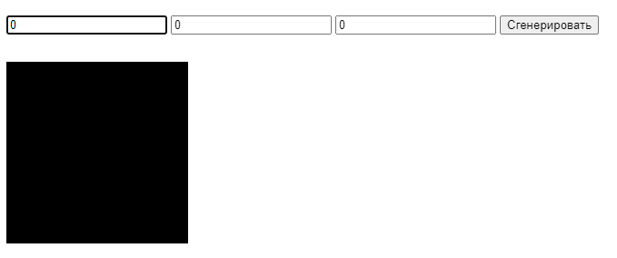
___________________________________________________
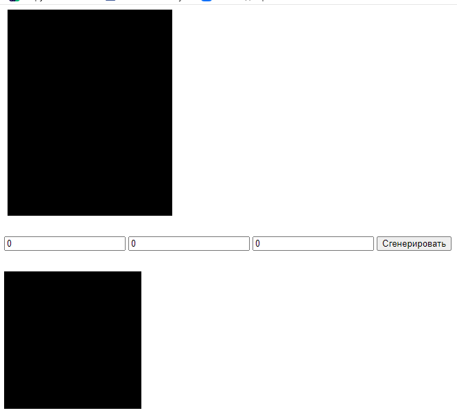
___________________________________________________
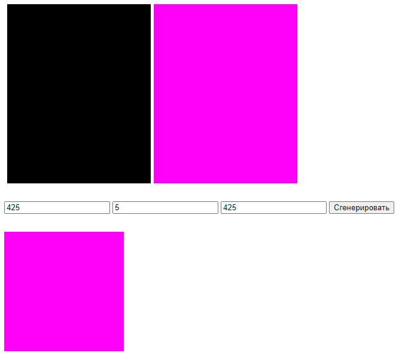
___________________________________________________
#### Задание 4. Финальный этап
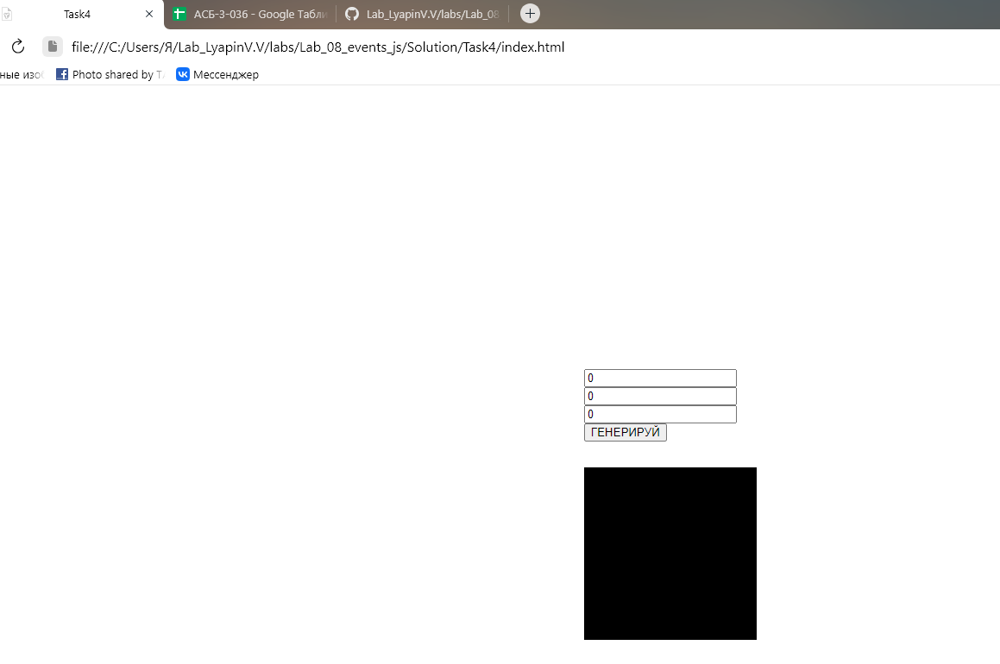
___________________________________________________
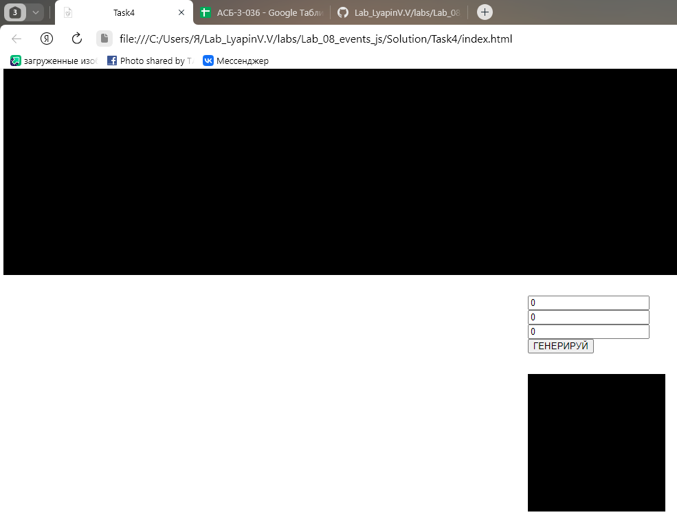
___________________________________________________

___________________________________________________