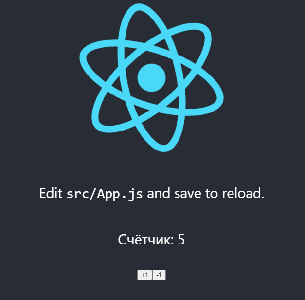

# Знакомство с REACT
___________________________________________________
## Лабораторная работа №9
***Ляпин В.В. [АСБ-3-036]***
___________________________________________________
После мутарной установки Node.js.
 
В нужной деректрории я создал проект и назвал его "lab9".

Затем для выполнения всех заданий нам необходимо 3 файла: 
- **Counter.js** (Счетчик)


**КОД:**
```js
import React, { useState } from 'react';

const Counter = () => {
    const [count, setCount] = useState(0);

    return (
        <div>
            <p>Счётчик: {count}</p>
            <button onClick={() => setCount(count + 1)}>+1</button>
            <button onClick={() => setCount(count - 1)}>-1</button>
        </div>
    );
}

export default Counter;
```
___________________________________________________
- **UserPosts.js** (Список постов пользоваталей, добавления и удаления постов, тэги к постам)

**КОД:**
```js
import React, { useState, createContext, useContext } from 'react';

const PostsContext = createContext();

const Post = ({ id, username, text, tags, onDelete, onLike, liked }) => {
    const { selectedTags, toggleTag } = useContext(PostsContext);

    return (
        <div style={{ border: '1px solid #ccc', padding: '10px', margin: '10px' }}>
            <h3>{username}</h3>
            <p>{text}</p>
            <div>
                {tags.map((tag) => (
                    <button
                        key={tag}
                        style={{ margin: '5px', fontWeight: selectedTags.includes(tag) ? 'bold' : 'normal' }}
                        onClick={() => toggleTag(tag)}
                    >
                        {tag}
                    </button>
                ))}
            </div>
            <button onClick={() => onDelete(id)}>Удалить</button>
            <button onClick={() => onLike(id)}>
                {liked ? 'Unlike' : 'Like'}
            </button>
            {liked && <div style={{ color: 'red' }}>Liked!</div>}
        </div>
    );
};

const UserPosts = () => {
    const [posts, setPosts] = useState([
        { id: 1, username: "Влад Ляпин", text: "Я делаю 9 лабу по web.", tags: ["react", "Web"], liked: false },
        { id: 2, username: "Преподователь", text: "Боже, что ты тут навоял?!", tags: ["react", "Json"], liked: false }
    ]);
    const [newPostText, setNewPostText] = useState("");
    const [newPostUsername, setNewPostUsername] = useState("");
    const [selectedTags, setSelectedTags] = useState([]);

    const toggleTag = (tag) => {
        if (selectedTags.includes(tag)) {
            setSelectedTags(selectedTags.filter((selectedTag) => selectedTag !== tag));
        } else {
            setSelectedTags([...selectedTags, tag]);
        }
    };

    const handleAddPost = () => {
        const newPost = {
            id: posts.length + 1,
            username: newPostUsername,
            text: newPostText,
            tags: selectedTags,
            liked: false
        };
        setPosts([...posts, newPost]);
        setNewPostText("");
        setNewPostUsername("");
        setSelectedTags([]);
    };

    const handleDeletePost = (id) => {
        const updatedPosts = posts.filter((post) => post.id !== id);
        setPosts(updatedPosts);
    };

    const handleLikePost = (id) => {
        const updatedPosts = posts.map((post) =>
            post.id === id ? { ...post, liked: !post.liked } : post
        );
        setPosts(updatedPosts);
    };

    const uniqueTags = Array.from(new Set(posts.flatMap((post) => post.tags)));

    return (
        <PostsContext.Provider value={{ selectedTags, toggleTag }}>
            <div>
                <h2>Список постов пользователей</h2>
                <div>
                    {uniqueTags.map((tag) => (
                        <button key={tag} onClick={() => toggleTag(tag)}>
                            {tag}
                        </button>
                    ))}
                </div>
                {posts.map((post) => (
                    <Post
                        key={post.id}
                        id={post.id}
                        username={post.username}
                        text={post.text}
                        tags={post.tags}
                        liked={post.liked}
                        onDelete={handleDeletePost}
                        onLike={handleLikePost}
                    />
                ))}
                <h3>Добавить новый пост</h3>
                <input
                    type="text"
                    value={newPostUsername}
                    onChange={(e) => setNewPostUsername(e.target.value)}
                    placeholder="Имя пользователя"
                />
                <input
                    type="text"
                    value={newPostText}
                    onChange={(e) => setNewPostText(e.target.value)}
                    placeholder="Текст поста"
                />
                <button onClick={handleAddPost}>Добавить пост</button>
            </div>
        </PostsContext.Provider>
    );
};

export default UserPosts;
```
___________________________________________________
- **App.js**

**КОД:**
```js
import logo from './logo.svg';
import './App.css';
import Counter from './Counter';
import UserPosts from './UserPosts';

function App() {
    return (
        <div className="App">
            <header className="App-header">
                
                <p>
                    Edit <code>src/App.js</code> and save to reload.
                </p>
                <Counter />
                <UserPosts />
                <a
                    className="App-link"
                    href="https://reactjs.org"
                    target="_blank"
                    rel="noopener noreferrer"
                >
                    Learn React
                </a>
            </header>
        </div>
    );
}

export default App;
```
___________________________________________________
#### Продемонстрирую что получилось в итоге:

**Задание с счётчиком:**

Общий вид:


Возможность увеличения:



Возможность уменьшения:


**Задание с постами:**

Общий вид:


Возможности like, сфортировка по тегу и добовление:


Удаление работает, показыать не буду :))

Ладно шучу вот даже лайк убрал:

